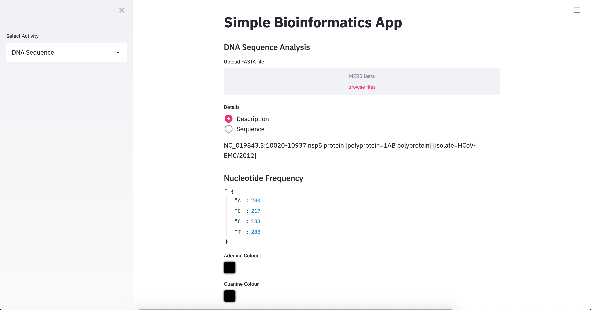

### General Bioinformatics App

A general bioinformatics app that can parse `fasta` files and read the sequence.
The app can plot nucleotide frequency, display nucleotide content (composition),
show transcription sequence, translation sequence, complement sequence, amino
acid frequency, full and short-name of amino acids, and finally, a dot plot
of two input sequences.

Code was inspired by [JCharisTech](https://jcharistech.wordpress.com/).

#### Installation
Requires `Streamlit` installed. Simply type in `streamlit run app.py`.

#### Demo of the app

- screenshot 1

- screenshot 2

